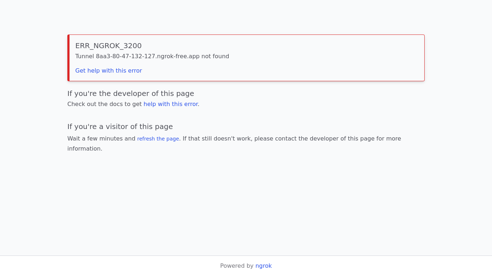

# Alpaca Image Generator

Generate unique alpaca images and share with your friends.

Website screenshot created using Github workflows:


# Features 

- Random Alpaca: Click random to generate a alpaca with random attributes 
- Customise: Customise your alpaca's eyes, ears, accessories and more
- Download: Download your alpaca as a png

# Tech Stack

React.js: Front-end library for building user interfaces
SASS: Preprocessor scripting language that is interpreted or compiled into CSS
Alpaca API: Stores the data for the Alpacas

# Getting Started

Clone the repository
Install dependencies: npm install
Start the development server: npm start
Open http://localhost:3000 in your browser.
```
alpaca-image-generator
├─ .fontello-session
├─ .gitignore
├─ babel.config.js
├─ config.json
├─ package-lock.json
├─ package.json
├─ public
│  ├─ index.html
│  ├─ manifest.json
│  └─ robots.txt
├─ README.md
└─ src
   ├─ alpaca
   │  ├─ accessories
   │  │  ├─ default.png
   │  │  ├─ earings.png
   │  │  ├─ flower.png
   │  │  └─ glasses.png
   │  ├─ backgrounds
   │  │  ├─ blue50.png
   │  │  ├─ blue60.png
   │  │  ├─ blue70.png
   │  │  ├─ darkblue30.png
   │  │  ├─ darkblue50.png
   │  │  ├─ darkblue70.png
   │  │  ├─ default.png
   │  │  ├─ green50.png
   │  │  ├─ green60.png
   │  │  ├─ green70.png
   │  │  ├─ grey40.png
   │  │  ├─ grey70.png
   │  │  ├─ grey80.png
   │  │  ├─ red50.png
   │  │  ├─ red60.png
   │  │  ├─ red70.png
   │  │  ├─ yellow50.png
   │  │  ├─ yellow60.png
   │  │  └─ yellow70.png
   │  ├─ ears
   │  │  ├─ default.png
   │  │  ├─ tilt-backward.png
   │  │  └─ tilt-forward.png
   │  ├─ eyes
   │  │  ├─ angry.png
   │  │  ├─ default.png
   │  │  ├─ naughty.png
   │  │  ├─ panda.png
   │  │  ├─ smart.png
   │  │  └─ star.png
   │  ├─ hair
   │  │  ├─ bang.png
   │  │  ├─ curls.png
   │  │  ├─ default.png
   │  │  ├─ elegant.png
   │  │  ├─ fancy.png
   │  │  ├─ quiff.png
   │  │  └─ short.png
   │  ├─ leg
   │  │  ├─ bubble-tea.png
   │  │  ├─ cookie.png
   │  │  ├─ default.png
   │  │  ├─ game-console.png
   │  │  ├─ tilt-backward.png
   │  │  └─ tilt-forward.png
   │  ├─ mouth
   │  │  ├─ astonished.png
   │  │  ├─ default.png
   │  │  ├─ eating.png
   │  │  ├─ laugh.png
   │  │  └─ tongue.png
   │  ├─ neck
   │  │  ├─ bend-backward.png
   │  │  ├─ bend-forward.png
   │  │  ├─ default.png
   │  │  └─ thick.png
   │  └─ nose
   │     └─ default.png
   ├─ App.js
   ├─ App.scss
   ├─ components
   │  ├─ Accessorize.jsx
   │  ├─ Alpaca.jsx
   │  ├─ AlpacaArt.jsx
   │  ├─ Download.jsx
   │  ├─ Header.jsx
   │  ├─ Random.jsx
   │  └─ Style.jsx
   ├─ fontello
   │  ├─ config.json
   │  ├─ css
   │  │  ├─ animation.css
   │  │  ├─ fontello-codes.css
   │  │  ├─ fontello-embedded.css
   │  │  ├─ fontello-ie7-codes.css
   │  │  ├─ fontello-ie7.css
   │  │  └─ fontello.css
   │  ├─ demo.html
   │  ├─ font
   │  │  ├─ fontello.eot
   │  │  ├─ fontello.svg
   │  │  ├─ fontello.ttf
   │  │  ├─ fontello.woff
   │  │  └─ fontello.woff2
   │  ├─ LICENSE.txt
   │  └─ README.txt
   ├─ index.js
   ├─ utils
   │  ├─ alpacaConfig.js
   │  └─ getImage.js
   └─ __tests__
      └─ puppeteer.spec.js

```